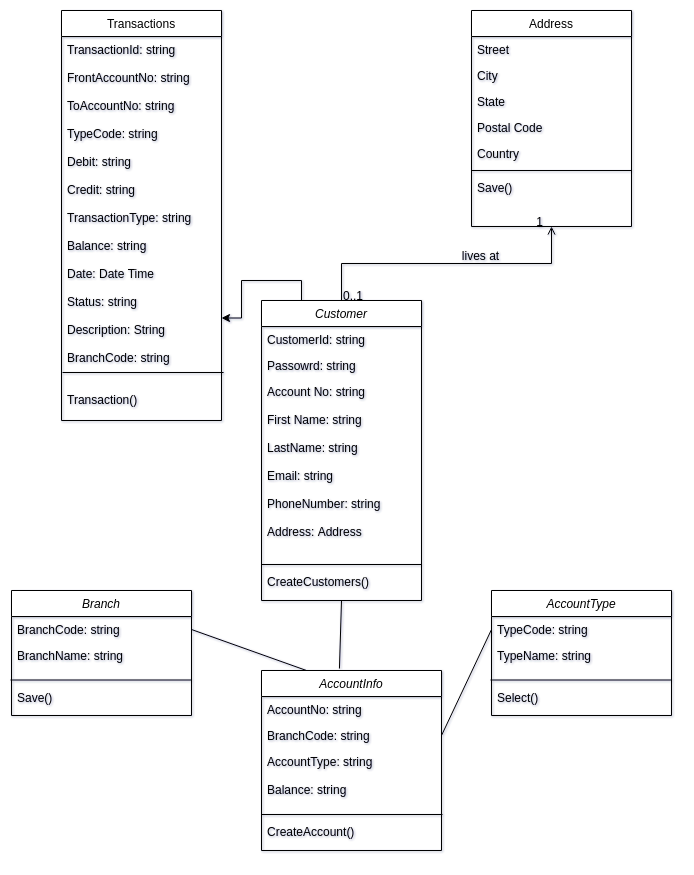
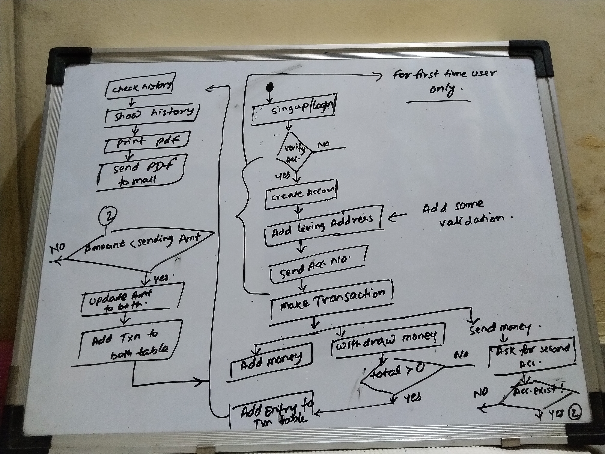

# bank-management-system

System Requirements:
1. Customer can create account with different type
2. After account creation customer can login with his unique username and password
3. System should create unique account number and encrypt his/her password
4. Customer can add balance to his/her account
5. Customer can send amount to another account
6. Customer can close/edit his/her account
7. System should able to notify customer on every ransactions
8. System should able to return total intrest on the amount
9. Customer should able to see his transaction history.


Use Cases:

Customer: Can make transactions and avail other services if applicable
System: Mainly responsible for sending notifications & genrating account number

A. Create/Edit/close Account: To create new account, edit or close account
B. debit/credit fund: to debit/credit fund to the account
C. transfer money: To make transaction to another account
D. View Account History: Check all transactions of account


Database Design:



Activity Diagram:



APIs
- Create Account API
```
http://localhost:1337/user/register?fullName=Ajay Kumar&email=xyz@gmail.com&password=abc@123
```
- Login API
```
http://localhost:1337/user/login?email=xyz@gmail.com&password=abc@123
```
- Open Account API
```
http://localhost:1337/account/open?street=Hinjewadi&city=Pune&postalCode=411057&country=india
```
- Get Account Details API
```
http://localhost:1337/account/info?email=xyz@gmail.com
```

- Deposit money API
```
http://localhost:1337/account/deposit?amount=100453
```

- Withdraw Money API
```
http://localhost:1337/account/withdraw?amount=500
```
- Transfer Money API
```
http://localhost:1337/account/transfer?account=667175841&fullName=Ajay Kumar&amount=13
```
- Account History API
```
http://localhost:1337/account/history
```


Steps to run Application:
1. Clone this repository to your local machine
2. Go to  config/datastores.js and add your database connections
3. Now open config/email.js and add correct username and password for the app
4. Now you are ready to use our banking App.

My assumptions:
1. I haven't added branch code in the design. I'm assuming this application is only for one bank. This can be done but due to time lack haven't added it.
2. I haven't added account type of the users. Currently all users will have only one type of account.
